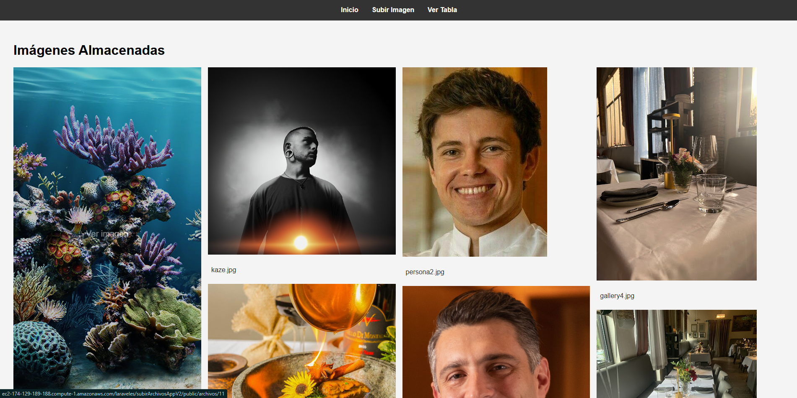
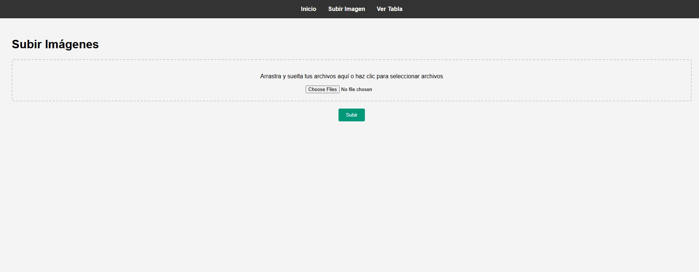
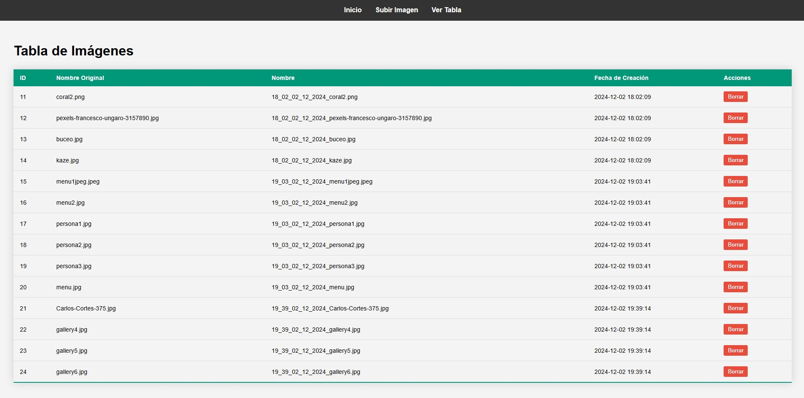

# Proyecto de Galería de Imágenes

Este proyecto es una aplicación web de galería de imágenes construida con Laravel. Permite a los usuarios subir imágenes, ver una galería de imágenes almacenadas, y eliminar imágenes. Las imágenes se almacenan en un directorio privado y se sirven de manera segura.

## Características

- Subida de múltiples imágenes a través de un formulario con arrastrar y soltar.
- Visualización de una galería de imágenes en un diseño de cuadrícula.
- Visualización de una tabla con detalles de las imágenes almacenadas.
- Eliminación de imágenes con confirmación.
- Almacenamiento seguro de imágenes en un directorio privado.

## Interfaz

### Galeria

### Subir archivos

### Tabla

